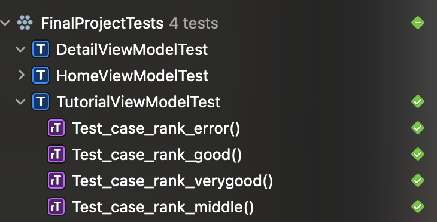
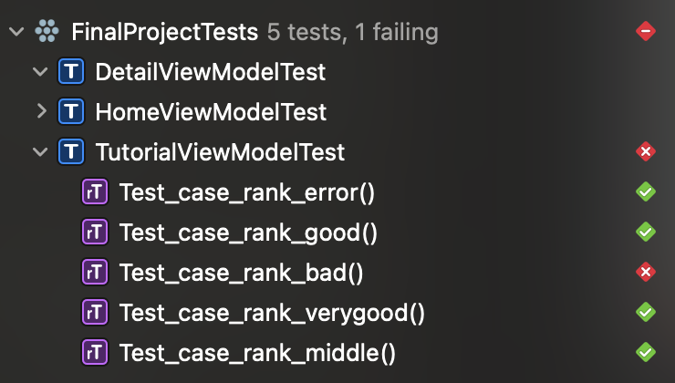

# Hello Testing IOS

## 1. Giới thiệu

Hello mọi người! Chào mọi người đến với chuỗi bài về test trong iOS..

Mình là Tâm và những bài viết là những gì mà mình biết được, tìm hiểu được và đã trải qua được. Mình sẽ cố gắng truyền tải hết kiến thức và kinh nghiệm của mình cho các bạn mới bước vào nghề hoặc muốn tìm hiểu thêm, còn những người đã có nhiều năm kinh nghiệm thì cũng có thể đọc để coi thằng "ranh con" này viết cái gì, nếu đúng thì gật gù vỗ tay còn sai thì "tương tác" để mình có thể khắc phục nhé.

Bắt đầu nào!!!

## 2. Thuật ngữ trong Testing

### 2.1. Testing là gì?

Mọi người chắc ai cũng biết "test" là gì đúng không?

Test là kiểm thử (theo google translate), thêm "ing" nữa là quá trình test, giai đoạn test.

Vậy trong Software development thì nó được định nghĩa như thế nào? 

> Testing là một bước cực kì quan trọng trong quá trình phát triển phần mềm. Mục đích của testing là đảm bảo phần mềm chạy đúng yêu cầu của client hoặc yêu cầu đã được đặt ra từ trước.

### 2.2. Test in iOS

Nếu bạn là người lần đầu viết trong trong Xcode thì chuỗi bài này sẽ giúp bạn hiểu được đâu đó về các bước phải làm để test được một app.

#### 2.2.1. UnitTest

Lúc chém gió với bạn bè thì ta có thể nói:

> Unit là đơn vị, test là kiểm thử. Vậy hiểu nôm na là kiểm thử từng đơn vị code.

Còn lúc phỏng vấn thì :

> UnitTest là phương pháp dùng để kiểm tra tính đúng đắn của một đơn vị source code.

> Đơn vị source code là phần nhỏ nhất có thể test được của chương trình.


## 3. Vậy tại sao phải viết UnitTest?

1. **Bất kì bugs cũng sẽ tìm thấy dễ dàng và nhanh chóng.**

    Code mà được bao phủ bởi tests thì có độ tin tưởng cao hơn nhiều so với không có test. Nếu một feature bị thay đổi, coder sẽ nhận ra nguồn gốc của sự việc liền.
    > Trường hợp này, coder sẽ tra "author" xem ai sửa code dẫn đến bug và "nói lời yêu thương" với đồng nghiệp =))

2. **UnitTest tiết kiệm thời gian và tiền bạc.**

    Khi mà unittest đã hoàn thành, nhiều bug được tìm thấy phase này và có thể ngăn chặn nó ở phase tiếp theo và giúp ta "including" sau khi release.

    Nó giúp tiết kiệm chi phí đồng thời cũng mang lại lợi ích cuối cùng cho các user.

3. **UnitTest cải thiện độ bao phủ của code (code coverage)** 

Đó là những tác dụng chính của việc viết UnitTest.

## 4. Các loại UnitTest trong iOS.

Xcode cung cấp 3 kiểu test chính.

1. **Functional Test**: tập trung test các func.
   Ví dụ: Test các func xử lí logic, test số lượng cell trong một section, test số lượng section trong một tableView, test data từ server trả về có đúng không nè, nhiều lắm v.v.
2. **Perfomance Test**: tập trung và khả năng thực thi các task trên các thiết bị khác nhau.
   Ví dụ: Test task đó chạy trên IP13 Pro Max Mạ Kim Cương có đúng yêu cầu đề ra không?
3. **UI Test**: tập trung vào những tác vụ của người dùng trên giao diện.

Những bài tiếp tiếp theo, mình sẽ tập trung vào Functional Test, còn 2 loại kia nếu có thời gian thì mình sẽ đi sâu vào nhé.

## 5. UnitTest with MVVM

### 5.1. Tại sao thường sử dụng MVVM để viết unittest?

Những bạn nào đã từng làm dự án theo mô hình MVVM có thể hiểu nguyên nhân , còn bạn nào chưa biết thì đọc lại bài viết về [mô hình MVVM ở đây](https://fxstudio.dev/basic-ios-tutorial-mvvm) nhé.

> Mình giải thích ngắn gọn: Điểm mạnh của mô hình MVVM nằm ở ViewModel, nơi mà phân tích logic giữa View và Model. Nó giúp cho code được rành mạch và rõ ràng hơn.

Nên nó có thể hỗ trợ viết unit test rất tốt.

### 5.2. How to create a file test

**Step 1**:Vào thư mục Test -> NewFile -> Unit Test Case Class  -> Next


**Step 2**: Đặt tên cho file test.


Ở đây ta có viewModel có tên là "HomeViewModel" thì file test ta đặt "ViewModelTest" cho dễ phân biệt.


**Step 3**: Bước này rất quan trọng, các bạn nhớ tick Targets Tests nhé.


Nếu bạn tạo theo thứ tự như trên thì Xcode thì mặc định tick cho bạn. 

**Step 4**: Nhấn create thì ta đã tạo file test thành công.

### 5.3. How to Run the Test

Cách 1: Product -> Test hoặc nhấn Command-U.

Cách 2: Click ở Test navigator
* Success:



* Failure:



Cách 3: Nhấn button bên trái class test.


### 5.4. Basic example

Ở đây mình tạo một viewModel chứa một hàm xử lí logic cơ bản để giúp các bạn hiểu rõ nhất về test từng case nhỏ nhất nhé.

Ta có code như sau:

```swift
enum Rank {
    case bad
    case middle
    case good
    case verygood
    case error
}

class TutorialViewModel {

    func rankStudent(point: Float) -> Rank {
        switch point {
        case 0.0 ... 4.9:
            return .bad
        case 5.0 ... 6.9:
            return .middle
        case 7.0 ... 8.4:
            return .good
        case 8.5 ... 10.0:
            return .verygood
        default:
            return .error
        }
    }
}
```

Nhìn vào hàm **rankStudent()** ta dễ dàng nhìn vào số case chúng ta cần phải test đúng không nào?

Phụ thuộc vào điểm số thì chúng ta có tổng cộng 5 case cần phải test: bad, middle, good, verygood và error để nó có thể bao phủ toàn bộ logic của chúng ta.

> Bắt đầu test nào !!

```swift
import Nimble
import Quick

@testable import FinalProject

class TutorialViewModelTest: QuickSpec {
    
    override func spec() {
        var viewModel: TutorialViewModel!
        
        beforeEach {
            viewModel = TutorialViewModel()
        }
        it("Test case rank bad") {
            expect(viewModel.rankStudent(point: 3)) == .bad
            expect(viewModel.rankStudent(point: 3)).to(equal(.bad))
        }
        it("Test case rank middle") {
            expect(viewModel.rankStudent(point: 6)) == .middle
            expect(viewModel.rankStudent(point: 6)).toNot(equal(.bad))
        }
        it("Test case rank good") {
            expect(viewModel.rankStudent(point: 8.2)) == .good
            expect(viewModel.rankStudent(point: 8.2)).toNot(equal(.middle))
        }
        it("Test case rank verygood") {
            expect(viewModel.rankStudent(point: 8.6)) == .verygood
            expect(viewModel.rankStudent(point: 8.2)).toNot(equal(.middle))
        }
        it("Test case rank error") {
            expect(viewModel.rankStudent(point: 11)) == .error
        }
        afterEach {
            viewModel = nil
        }
    }
}

```

Các bạn tạm bỏ qua các râu ria và setup các thứ nhé. Mình sẽ giải thích kĩ hơn về những thứ này ở bài tiếp theo khi chúng ta tìm hiểu về **Nimble/Quick.**

Chúng ta tập trung vào các **expect** có trong code nhé.

> expect là kì vọng, mong muốn, đoán trước (theo google transle)

Vậy nên chúng ta cũng đoán được câu lệnh này **kiểm thử** các kết quả trả về có đúng với specs của client hay đơn giản là logic code của chúng ta.
Ví dụ:

Input: Học sinh được 3 điểm.

Output: Đạt danh hiệu học sinh kém.

```swift
        it("Test case rank bad") {
            expect(viewModel.rankStudent(point: 3)) == .bad
            expect(viewModel.rankStudent(point: 3)).to(equal(.bad))
        }
```

Ta thấy được điểm 3 nằm trong khoảng 0 .. 4.9 nên rõ ràng nó sẽ rời vào trường hợp .bad đúng không nào :D.

Tương tự với các case còn lại thì ta được kết quả test như sau:

![image_011](../images/011.png

Độ bao phủ đã "**xanh**" ở toàn bộ viewModel

![image_012](../images/012.png

## 6. Tạm kết
Đây là bài hướng dẫn cơ bản đầu tiên để giới thiệu và khởi tạo các file test và ví dụ cơ bản để các hiểu được các case test như thế nào.
Bài tiếp theo mình sẽ hướng dẫn viết test chi tiết hơn.

Thank you.
