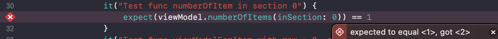

# UnitTest with Nimble, Quick

## 1. Chuẩn bị

Đầu tiên bạn phải hoàn thành tạo file test như ở [đây]().

XCode sẽ sử dụng công cụ test default của Apple là XCTest, có rất nhiều lợi ích khi dùng XCTest nhưng đối với dev luôn muốn tìm kiếm một phương pháp nào dễ dàng hơn và "clean" hơn cho code.

Đó là lí do mình sẽ giới thiệu bài hướng dẫn sử dụng Quick và Nimble này.

Quick và Nimble cung cấp những chức năng tương tự viết test như XCTest, nhưng khi bạn sử dụng Quick/Nimble thì sẽ thấy dễ dàng, gần gũi hơn rất nhiều.

> Nói chung dùng cái nào cũng được , miễn test coverage 100% là được =)))

### 1.1. Cài đặt thư viện


Các bạn nhớ để **Nimble** và **Quick** ở trong target **Tests** nha, cụ thể ở đây là "FinalProjectTests".
Nếu bỏ nhầm chổ khác thì lúc import nó ở file test sẽ không nhận đâu.

## 2. Giới thiệu Quick, Nimble

### 2.1. Quick

> *Quick là một testing framework, là nơi cung cấp những methods thuận tiện cho công việc viết test.*

Nó sử dụng func **spec()** để định nghĩa toàn bộ code test.

Func **spec()** hỗ trợ cho việc chia nhiều sections.

* Ví dụ: Ở viewModel sẽ có những hàm xử lí logic và hàm xử lí api thì ta sẽ chia nó thành 2 section khác nhau để cho nó clear và những người khác lúc vào maintain test cũng có thể dễ dàng tìm được.

**Một số cú pháp có trong Quick:**

* **it**: được dùng để định nghĩa kết quả kì vọng cụ thể nhất. 

 Hiểu nôm na sử dụng **it** để test một case cụ thể nào đó trong một source code, có bao nhiêu case thì có bấy nhiêu **it**.

```swift
enum Gender {
    case male
    case female
}

func identify(gender: Gender) -> String {
    switch gender {
    case .male { return "have bird" }
    case .female { return "dont have bird :("}
    }
}
```

 Như bạn thấy hàm này nó trả về kiểu string và có 2 case để nó trả về giá trị khác nhau nên khi test sử dụng 2 câu lệnh it để có thể "**bao phủ**" cả hàm trên.

* **context**: được đùng để định nghĩa các "specific context" của một tác vụ nào đó mà bạn phải test.

 Các case khác nhau tạo ra một hàm xử lý, từ đó suy ra được nhiều "**it**" nó tạo ra một **context**.

Như ví dụ trên: 2 cái "**it**" tạo ra một **context**. Context này để giúp xác định giới tính của một người nào đó trong lớp học.

> Tóm lại trong code, những case nào mà cùng liên quan đến một tác vụ, một chức năng nào đó thì gom lại thành 1 context.

* **describle**: được dùng để định nghĩa nhưng tác vụ lớn hoặc hành vi mà bạn phải test

 Cũng tương tự như vậy, nhiều **context** sẽ tạo ra **describle**.

Cũng với ví dụ trên, trong một lớp học cần xác định giới tính(context) , xác định học lực(context), kiểm tra hành kiểm (context).. Nhiều cái thì chúng ta gom chúng vào một **describle**.

> Vậy buộc phải dùng tất cả hả ?  Trả lời : Không.
>
> Vậy dùng toàn "it" được không? Trả lời:  Được.Nhưng...

Ví dụ:

```swift
		it("Test case rank bad") {
            expect(viewModel.rankStudent(point: 3)) == .bad
            expect(viewModel.rankStudent(point: 3)).to(equal(.bad))
        }
        it("Test case gender male") {
            expect(viewModel.identify(gender: .male)) == "have bird"
        }
        it("Test case rank middle") {
            expect(viewModel.rankStudent(point: 6)) == .middle
            expect(viewModel.rankStudent(point: 6)).toNot(equal(.bad))
        }
        it("Test case rank good") {
            expect(viewModel.rankStudent(point: 8.2)) == .good
            expect(viewModel.rankStudent(point: 8.2)).toNot(equal(.middle))
        }
        it("Test case rank verygood") {
            expect(viewModel.rankStudent(point: 8.6)) == .verygood
            expect(viewModel.rankStudent(point: 8.2)).toNot(equal(.middle))
        }
        it("Test case gender female") {
            expect(viewModel.identify(gender: .female)) == "dont have bird :("
        }
        it("Test case rank error") {
            expect(viewModel.rankStudent(point: 11)) == .error
        }
```

```swift
        context("Test rank") {
            it("Test case rank bad") {
                expect(viewModel.rankStudent(point: 3)) == .bad
                expect(viewModel.rankStudent(point: 3)).to(equal(.bad))
            }
            it("Test case rank middle") {
                expect(viewModel.rankStudent(point: 6)) == .middle
                expect(viewModel.rankStudent(point: 6)).toNot(equal(.bad))
            }
            it("Test case rank good") {
                expect(viewModel.rankStudent(point: 8.2)) == .good
                expect(viewModel.rankStudent(point: 8.2)).toNot(equal(.middle))
            }
            it("Test case rank verygood") {
                expect(viewModel.rankStudent(point: 8.6)) == .verygood
                expect(viewModel.rankStudent(point: 8.2)).toNot(equal(.middle))
            }
            it("Test case rank error") {
                expect(viewModel.rankStudent(point: 11)) == .error
            }
        }
        context("Test gender") {
            it("Test case gender male") {
                expect(viewModel.identify(gender: .male)) == "have bird"
            }
            it("Test case gender female") {
                expect(viewModel.identify(gender: .female)) == "dont have bird :("
            }
        }
```

Qua 2 cách viết trên ta thấy được cách nào cũng mang lại kết quả tối ưu là test pass.

Nhưng khi người sau khi vào maintain hay lỡ có bị fail thì dev trố mắt nhìn để tìm kiếm đến đến case nào bị lỗi, func nào bị fail và nhìn vào chả có cảm tình gì cả.

Theo bản thân mình nhận thấy, mô hình MVC, MVVM hay bất kì mô hình gì thì chúng ta cũng chia code ra để quản lý và maintain dễ hơn mà thôi.
Thì viết test case cũng vậy, viết sao cho người sau vào đọc nói "dễ chịu", cấu trúc rõ ràng. Không phải test case func này rồi thích nhảy qua test case của func kia.

> Tâm-Kun yêu cái đẹp!!!

*  **beforeEach**: tương tự như setup vậy, chúng ta chuẩn bị dữ liệu test ở **beforeEach**.
*  **afterEach**: context nó chạy xong thì nó sẽ vào **afterEach** để config dữ liệu lại theo như mong muốn.


### 2.2. Nimble


> Nimble cũng là một framework cung cấp rất nhiều các options để giúp thoả mãn được các "kì vọng" test.

Keyword "***expect***" trong **Nimble** rất quan trọng. Nó thay thế cho XCTAssertion của hàng chính hãng XCTest

Expect là "kì vọng", có nghĩa là chúng ta kì vọng trường hợp đó output ra như ta mong đợi. Thư viện Nimble hỗ trợ ta rất nhiều để có thể "expect" được những giá trị, kiểu dữ liệu hay so sánh 2 đối tượng nào đó ở nhiều trường hợp. Rất tiện lợi đúng không nào!
Chúng ta tiếp tục xem Nimble hỗ trợ cho việc test về những gì nhé!

#### 2.2.1.  Hỗ trợ kiểm thử trong quá trình đồng bộ. 

```swift
expect(1 + 1).to(equal(2)) // so sánh bằng
expect(1.2).to(beCloseTo(1.1, within: 0.1)) // xấp xỉ trong giới hạn là bao nhiêu
expect(3) > 2 // so sánh hơn, kém
expect("seahorse").to(contain("sea")) // kiểm thử có chứa phần tử hay không?
expect(["Atlantic", "Pacific"]).toNot(contain("Mississippi")) // kiểm thử không chứa phần tử hay không?
expect(1 + 1).to(equal(3), description: "Make sure 1+1 = 2")
// Bạn muốn add thêm thông tin đến khi test case đó bị sai thì thêm argument description.
```

#### 2.2.2. Hỗ trợ kiểm thử trong quá trình bất đồng bộ. 

**Nimble** cung cấp ta 2 cách để nhận biết rằng code chúng ta đang chạy là bất đồng bộ. Đó là **toEventually** và **waitUntil**.

* **toEventually**:

  Có một điều mình rất thích ở Nimble nói chung và toEventually nói riêng là nó cho phép ta viết kì vọng test nhưng đang đọc tiếng anh.

  > "*Expect value to eventually be this*"
  >
  > Giá trị mong đợi cuối cùng là ...

  Có nghĩa là toEventually giúp bạn có thể dự đoán một thứ gì đó **"trong tương lai"**.

  ```swift
  DispatchQueue.main.async {
      ocean.add("dolphins")
      ocean.add("whales")
  }
  expect(ocean).toEventually(contain("dolphins", "whales"))
  ```

  Ví dụ trên có ý nghĩa như sau: 

  Đối tượng **ocean** nó sẽ được đánh giá liên tục. Nếu nó đã từng chứa **dolphins** và **whales**, thì kì vọng sẽ pass. Ngược lại, nếu nó không chứa trong bất kì khoảng thời điểm nào bất chấp **ocean** được đánh giá liên tục thì kì vọng của chúng ta sẽ fail.

* **waitUntil**: nó là một func được cung cấp bởi Nimble và hỗ trợ cho quá trình test bất đồng bộ.

Phần này mình chỉ nói sơ qua để mọi người hiểu một phần nào đó, bài tiếp theo test bất đồng bộ liên quan đến server sẽ được nói rõ hơn.

> Nimble lo tất cả :)) chúng ta chỉ cần dùng mà thôi :D

Các bạn muốn biết nhiều hơn về cách dùng thì vào [đây](https://github.com/Quick/Nimble) xem nhé.

Thôi lí thuyết rứa đủ rồi, qua làm cái ví dụ là hiểu liền.

## 3. Example

Giới thiệu qua ViewModel chúng ta cần test một chút, thì nó sẽ lấy data từ api về và fill data vào cái tableView nên sẽ có 2 tác vụ chính.

1. Các hàm xử lí api.
2. Các hàm xử lí logic, cung cấp dữ liệu đổ vào tableView.

**Step 1**:

```swift
import Nimble
import Quick

@testable import FinalProject

class HomeViewModelTest: QuickSpec { }
```

Đầu tiên, tất nhiên là phải import thư viện cần dùng.

Chú ý tiếp theo, các bạn sẽ thấy được cú pháp **@testable import** thì nó để làm gì?

> @testable import giúp chúng ta khai báo thêm, tức là khi dùng nó ta sẽ add được file khác target vào target test, để phục vụ cho việc test.

Tiếp theo, đảm bảo class test phải kế thừa "QuickSpec"

Việc kết thừa QuickSpec thì chúng ta có thể **override func spec()** thì công dụng của nó thì như ta đã nói phía trên.

Cuối cùng là khởi tạo một instance để dùng và bỏ ở trong hàm **spec()**.

```swift
var viewModel: HomeViewModel!
```

**Step 2**:

Ta sử dụng **describle**" để mô tả mục đích lớn nhất của ta trong việc test viewModel này là gì?

Ở đây thì ta đang test các chức năng của màn hình Home nên ta có thể viết như sau:

```swift
describe("Test funcs homeScreen") {...}
```

**Step 3**:

Trong **describle** thì sẽ có nhiều **context**.

Như chúng ta đã phân tích, thì có 2 tác vụ chính thì ta sẽ có 2 "**context**".

```swift
context("Test some funcs related to tableView") { ... }
context("Test func related to api") { 
// Phần này chúng ta phân tích kĩ hơn ở bài sau
}
```

**Step 4**:

Trong cái context đầu tiên, chúng ta sẽ bắt đầu test các func liên quan đến tableView.

Sử dụng **beforeEach**, để chuẩn bị dữ liệu test.

```swift
beforeEach {
        viewModel = HomeViewModel()
        viewModel.musics = DummyData.dummyMusics
                }
```

Hiện tại chúng ta chưa có dữ liệu fake để test nên ta sẽ viết extension để tạo ra một DummyData.

```swift
extension HomeViewModelTest {
    
    struct DummyData {
        static var dummyMusics: [Music] {
            var items: [Music] = []
            // dummy
            let item1 = Music()
            item1.name = "tam"
            let item2 = Music()
            item2.name = "tien"
            items.append(item1)
            items.append(item2)
            return items
        }
    }
}
```

**Step 5**:

Bắt đầu test từng case nào.

Số lượng section trong một tableView.

```swift
    func numberOfSections() -> Int {
        return 1
    }
```

```swift
                it("Test func numberOfSection") {
                    expect(viewModel.numberOfSections()) == 1
                    // cach khac
                    expect(viewModel.numberOfSections()).to(equal(1))
                }
```

Số lượng items trong một section.

```swift

    func numberOfItems(inSection section: Int) -> Int {
        return musics.count
    }
```

```swift
                it("Test func numberOfItem in section 0") {
                    expect(viewModel.numberOfItems(inSection: 0)) == 2
                }
```

Chúng ta dummyData với cái mảng musics có 2 items nên chúng ta "expect" là 2.

Vậy nếu chúng ta expect là 1 thì điều gì xảy ra?



Nó sẽ test fail case này và còn gợi ý kết quả "expect" đúng.

```swift
    func viewModelForItem(at indexPath: IndexPath) -> HomeCellViewModel {
        return HomeCellViewModel(item: musics[indexPath.row], index: indexPath.row)
    }
```


```swift
                it("Test func viewModelForItem with row = 0, section = 0") {
                    expect(viewModel.viewModelForItem(at: IndexPath(row: 0, section: 0))).to(beAnInstanceOf(HomeCellViewModel.self))
                    
                    // cach khac
                    expect(viewModel.viewModelForItem(at: IndexPath(row: 0, section: 0)).item?.name) == "tam"
                }
```

Sau khi "**run**" test thì ta được kết quả như sau:


Và đây là toàn bộ phần test cho các bạn có cái nhìn tổng quan hơn.

```swift
    override func spec() {
        var viewModel: HomeViewModel!
        
        describe("Test funcs homeScreen") {
            context("Test some funcs related to tableView") {
                beforeEach {
                    viewModel = HomeViewModel()
                    viewModel.musics = DummyData.dummyMusics
                }
                it("Test func numberOfSection") {
                    expect(viewModel.numberOfSections()) == 1
                    // cach khac
                    expect(viewModel.numberOfSections()).to(equal(1))
                }
                it("Test func numberOfItem in section 0") {
                    expect(viewModel.numberOfItems(inSection: 0)) == 2
                }
                it("Test func viewModelForItem with row = 0, section = 0") {
                    expect(viewModel.viewModelForItem(at: IndexPath(row: 0, section: 0))).to(beAnInstanceOf(HomeCellViewModel.self))
                    
                    // cach khac
                    expect(viewModel.viewModelForItem(at: IndexPath(row: 0, section: 0)).item?.name) == "tam"
                }
                afterEach {
                    viewModel = nil
                }
            }
            context("Test func related to api") {
                
            }
        }
    }
```

Đó là một số ví dụ cơ bản khi sử dụng "**expect**".

Thư viện **Nimble** hổ trợ ta rất nhiều để giúp ta có thể đạt được mục đích test.

> Cứ làm nhiều vào, khó có stackoverflow :D

Qua đây, mình đã giới thiệu các bạn cách test cơ bản sử dụng thư viện Quick and Nimble. Và đã đưa ra một ví dụ cơ bản để sử dụng.

## 4. Tạm kết
Thực sự khi làm dự án thật, thì một viewModel có rất nhiều funcs cần được test và một app hoàn chỉnh thì lại có rất nhiều viewModel nữa.

Bài viết tiếp theo, mình sẽ hướng dẫn các bạn viết test đối với những case có liên quan đến api.

Các bạn có thể lấy example ở [đây](https://github.com/thientam0809/basic-unittest) để chạy demo.

Thank you.
