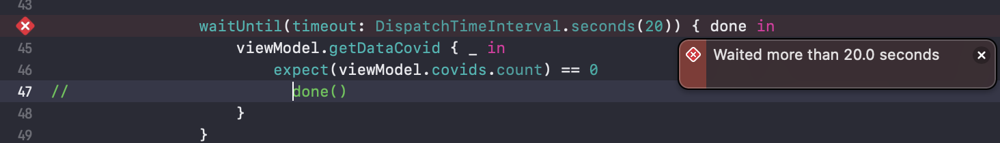

# UnitTest with OHHTTPStubs

## 1. Mở đầu.

Tiếp tục chuỗi bài liên quan đến test cùng fxstudio nào!

Đối với **functional test** ngoài việc test các hàm xử lí logic, hàm để setup data .v.v thì chúng ta cũng phải test các funcs liên quan đến server, response data, kiểm tra request đó thành công hay thất bại. 

### 1.1. Tại sao lúc test không nên phụ thuộc vào network?

Test phải đảm bảo nó nhanh, độc lập, có thể nhân rộng rà, tự verify được.
Và việc phụ thuộc vào network đã vi phạm những quy tắc này.

* Làm chậm việc test.

* Khó xác định.

  Có nghĩa là chúng ta sẽ bị phụ thuộc vào data trả về từ server. Bạn không thể đảm bảo data trả về sẽ đúng như những gì bạn kì vọng.

  Test cũng có thể bị "**time out**" bởi vì network ở một lúc nào đó nó sẽ bị tắt nghẽn hoặc server sẽ trả về một data không đúng do phía backend chạy migration trên mô staging server khác mà không thông báo cho bạn.

* Khó để test trường hợp error.

  Khi thực sự truy cập vào "**real server**", thì thật sự khó để nó có thể rơi trường hợp failure nếu rơi vào team backend xịn xò. Dẫn đến reponse data luôn success và không thể nào test được case failure.

  Vậy nên:

  Quá phụ thuộc và truy cập trực tiếp đến network sẽ làm việc test thực sự rất khó. 

  > **Đó là lí do chúng ta phải tách biệt, độc lập (decouple) từ network trong  unittest.**

Đó là lí do mình sẽ giới thiệu UnitTest with OHHTTPStubs.

## 2. Chuẩn bị.

Cài đặt và import thư viện như với Nimble và Quick.

```swift
pod 'OHHTTPStubs/Swift'
```
```swift
import OHHTTPStubs
```

Mọi thứ vẫn làm như bài trước và mình chỉ bắt đầu hướng dẫn lúc bắt đầu test với những func liên quan đến server nhé!  

##  3. OHHTTPStubs. 

###  3.1. Khái niệm.

* OHHTTPStubs: là một thư viện được thiết kế để "**stub**" cái request của bạn một cách dễ dàng.


### 3.2. Usage example.

Để nhanh gọn mình sẽ code example một "stub" đơn giản rồi phân tích từng dòng một nhé.

```swift
                stub(condition: isHost("api.coronavirus.data.gov.uk")) { _ in
                    let path: String! = OHPathForFile("detail.json", type(of: self))
                    return HTTPStubsResponse(fileAtPath: path, statusCode: 200, headers: nil)
                }
```
Thư viện OHHTTPStubs hỗ trợ chúng ta một hàm **"stub"** để giả lập một quá trình request.

Nó có parameter:

* condition: so khớp điều kiện coi đúng không , nếu đúng thì thực hiện request.

  Nó cung cấp cho ta các điều kiện như **isMethodGET()**,  **isMethodPOST()**, **isMethodPUT()**, **isHost**, **isPATH**.

  Ở ví dụ đây, ta sử dụng  **isHost** để check condition.

  > URL: https://api.coronavirus.data.gov.uk/v1/data

  thì:

  > Host: api.coronavirus.data.gov.uk

Hàm **stub** này sẽ trả về một HTTPStubResponse với các params:

* **fileAtPath**: chính là file json mà ta tự tạo ra xem như nó chính là data response từ server về.

  > Qua đó chúng ta thấy được rằng nhờ OHHTTPStubs mà chúng ta có thể control được response nó trả về như thế nào, dữ liệu ra sao để ta đạt được kết quả kì vọng đúng.

  ```swift
                      let path: String! = OHPathForFile("detail.json", type(of: self))
  ```

   

* **statusCode**:
  Chúng ta có thể control được mã trạng thái bằng cách nhập code mà mình mong muốn.

  **200**: Ok. Request đã được tiếp nhận và xử lý thành công.

  **400**: Bad Request. Server sẽ không thể xử lý hoặc sẽ không xử lý các request lỗi về phía client (request có cú pháp sai, ..)

  **500**: Internal Server Error: Lỗi server khi mà server gặp một sự cố nào đó.

  Còn nhiều statusCode khác nữa, tuỳ yêu cầu test những gì thì mình thay đổi statusCode thôi.

  Trong ví dụ này , thì chúng ta đang test 2 trường hợp cơ bản là success có data với statusCode là 200 và failure do bad request với status code là 400.

* Header: Tuỳ server có yêu cầu hay không, cần thì thêm vào không cần thì cho nó **nil**.

Ok! Vậy là chúng ta vừa tạo một stub để chuẩn bị cho việc test server.

> Stub ở đây nó như là một thành phần giả lập cho việc request lên server, giúp chúng ta tránh phải request trực tiếp với server với những lí do đã nêu ở đầu bài viết.

Tiếp tục nào:

```swift
                waitUntil(timeout: DispatchTimeInterval.seconds(20)) { done in
                    viewModel.getDataCovid { _ in
                        expect(viewModel.covids.count) == 841
                        done()
                    }
                }
```

Chúng ta tiếp tục sử dụng hàm **waitUntil** với param là **timeout** để thực hiện việc "chờ bất đồng bộ cho đến khi quá trình **done()** hoàn tất hoặc đã vượt quá timeout mà chúng ta cho phép"

Như trong ví dụ:

Nếu ta request lên server bằng cách gọi hàm **getDataCovid** cho đến khi quá thời gian 20s thì nó sẽ báo lỗi "timeout" như này.



Chúng ta phải gọi closure **done()** để báo rằng quá trình đợi đã được hoàn thành. Nếu không gọi thì nó sẽ chạy ở trong đó mãi và đến thời gian timeout thì nó sẽ báo lỗi như trên.

```swift
                        expect(viewModel.covids.count) == 841
```

 Ở đây chúng ta có dựa vào **detail.json** mà chúng ta đã tạo ra để dự đoán số item của mảng **covids** mà server trả về có đúng hay không.

Còn trường hợp kiểm tra **case failure**, bạn chỉ cần đổi status code từ 200 -> 400 để request của chúng ta thành bad request và kì vọng mảng **covids** sẽ là 0 hoặc rỗng.

```swift
                        expect(viewModel.covids.count) == 0
```

 Từ đó, chúng ta test đủ cả 2 case success và failure để đảm bảo coverage toàn bộ. Chúng ta có thể control được được sự thay đổi server bằng một số thay đổi thôi qua trình giả lập stub. Còn nếu ta request trực tiếp thì đảm bảo với bạn nó vừa lâu, vừa gây spam và rất khó để handle để nó "**được lỗi**".

## 4. Tạm kết.

Bài viết đã hướng dẫn bạn cách sử dụng thư viện OHHTTPStubs để test những funcs liên quan đến api.
Và từ đó ta có thể kết hợp với bài trước và bài này để có thể test được toàn bộ một viewModel cụ thể nào đó.
Bạn có thể checkout code example ở [đây](https://github.com/thientam0809/basic-unittest)
Bài tiếp theo mình sẽ hướng dẫn các bạn sẽ coverage ở Xcode nhé.
